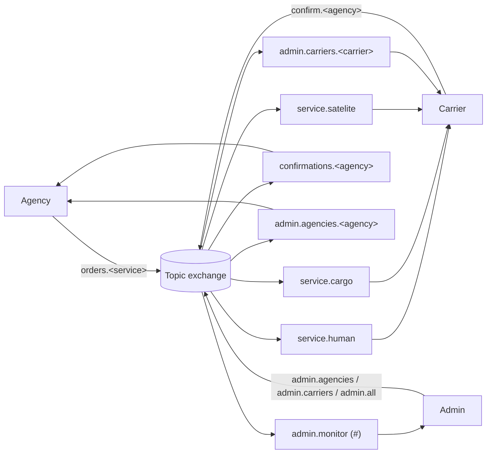

```mermaid
flowchart LR
    A[Agency] -- orders.&lt;service&gt; --> X[(Topic exchange)]
    X --> SH[service.human]
    X --> SC[service.cargo]
    X --> SS[service.satelite]

    SH --> C[Carrier]
    SC --> C
    SS --> C

    C -- confirm.&lt;agency&gt; --> X
    X --> QCONF[confirmations.&lt;agency&gt;]
    QCONF --> A

    AD[Admin] -- admin.agencies / admin.carriers / admin.all --> X
    X --> QA[admin.agencies.&lt;agency&gt;]
    X --> QC[admin.carriers.&lt;carrier&gt;]
    QA --> A
    QC --> C

    X --> MON["admin.monitor (#)"]
    MON --> AD
```
