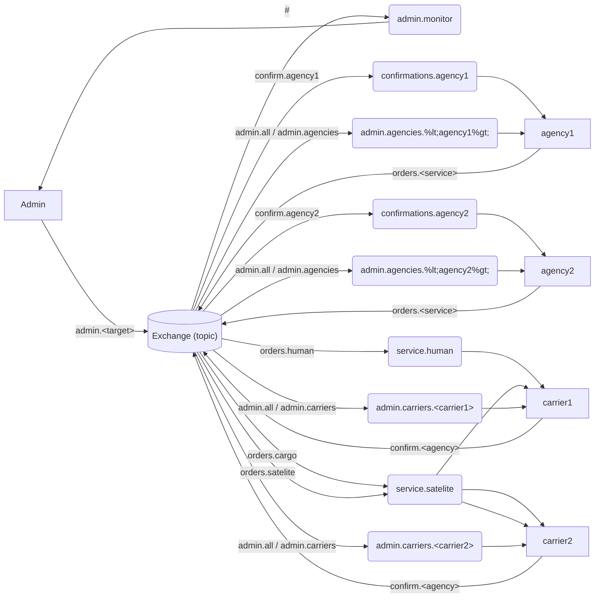

```mermaid
flowchart LR
    AD[Admin] -- admin.&lt;target&gt; --> X[("Exchange (topic)")]
    X -- "#" --> QAD(admin.monitor) --> AD

    A1[agency1] -- orders.&lt;service&gt; --> X
    X -- confirm.agency1 --> QA1(confirmations.agency1) --> A1
    X -- admin.all / admin.agencies --> QA1AD(admin.agencies.%lt;agency1%gt;) --> A1

    A2[agency2] -- orders.&lt;service&gt; --> X
    X -- confirm.agency2 --> QA2(confirmations.agency2) --> A2
    X -- admin.all / admin.agencies --> QA2AD(admin.agencies.%lt;agency2%gt;) --> A2

    C1[carrier1] -- confirm.&lt;agency&gt; --> X
    X -- orders.human --> QSH(service.human) --> C1
    X -- orders.cargo --> QSC(service.cargo) --> C1
    X -- admin.all / admin.carriers --> QC1(admin.carriers.&lt;carrier1&gt;) --> C1

    C2[carrier2] -- confirm.&lt;agency&gt; --> X
    QSC --> C2
    X -- orders.satelite --> QSC(service.satelite) --> C2
    X -- admin.all / admin.carriers --> QC2(admin.carriers.&lt;carrier2&gt;) --> C2
```
