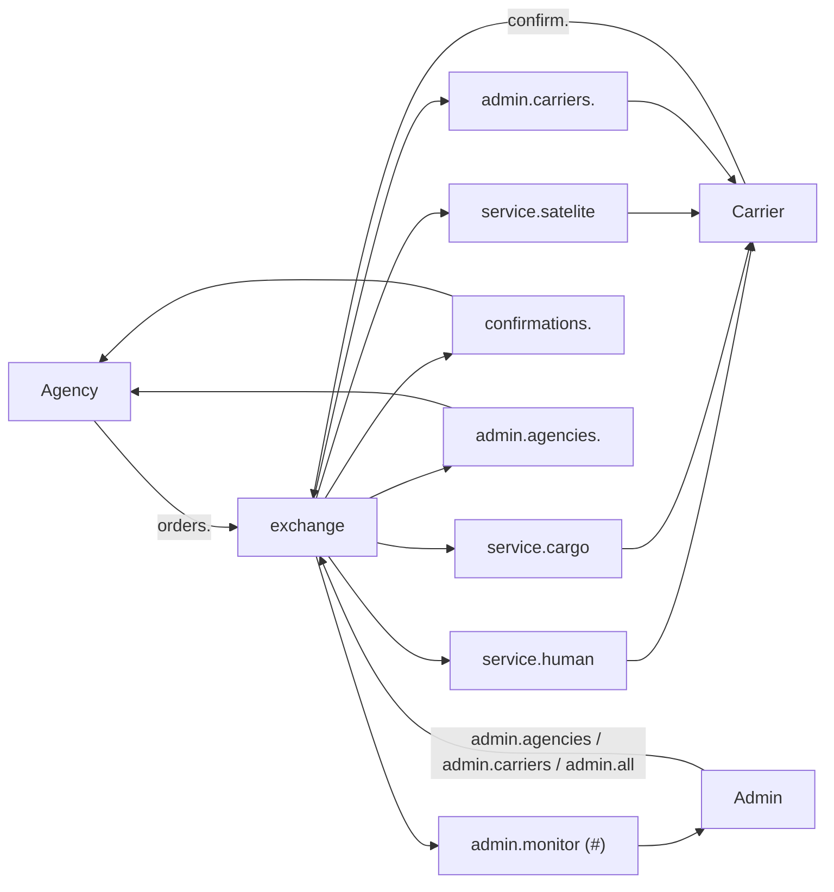

```mermaid
flowchart LR
    A[Agency] -- "orders.<service>" --> X[exchange]
    X --> SH[service.human]
    X --> SC[service.cargo]
    X --> SS[service.satelite]

    SH --> C[Carrier]
    SC --> C
    SS --> C

    C -- confirm.<agency> --> X
    X --> QCONF["confirmations.<agency>"]
    QCONF --> A

    AD[Admin] -- admin.agencies / admin.carriers / admin.all --> X
    X --> QA["admin.agencies.<agency>"]
    X --> QC["admin.carriers.<carrier>"]
    QA --> A
    QC --> C

    X --> MON["admin.monitor (#)"]
    MON --> AD
```
