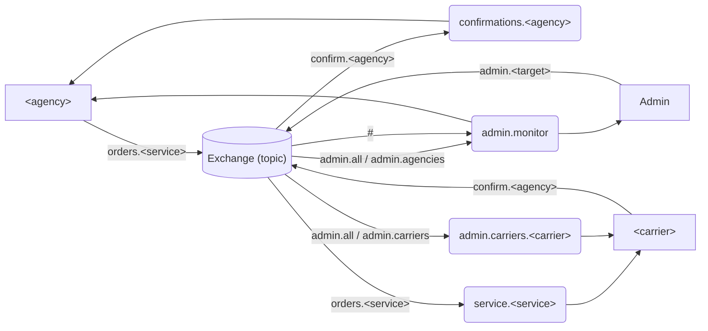

```mermaid
flowchart LR
    A[&lt;agency&gt;] -- orders.&lt;service&gt; --> X[("Exchange (topic)")]
    X -- confirm.&lt;agency&gt; --> QA(confirmations.&lt;agency&gt;) --> A
    X -- admin.all / admin.agencies --> QAD(admin.agencies.&lt;agency&gt;) --> A

    AD[Admin] -- admin.&lt;target&gt; --> X
    X -- "#" --> QAD(admin.monitor) --> AD

    C[&lt;carrier&gt;] -- confirm.&lt;agency&gt; --> X
    X -- orders.&lt;service&gt; --> QS(service.&lt;service&gt;) --> C
    X -- admin.all / admin.carriers --> QC(admin.carriers.&lt;carrier&gt;) --> C
```
