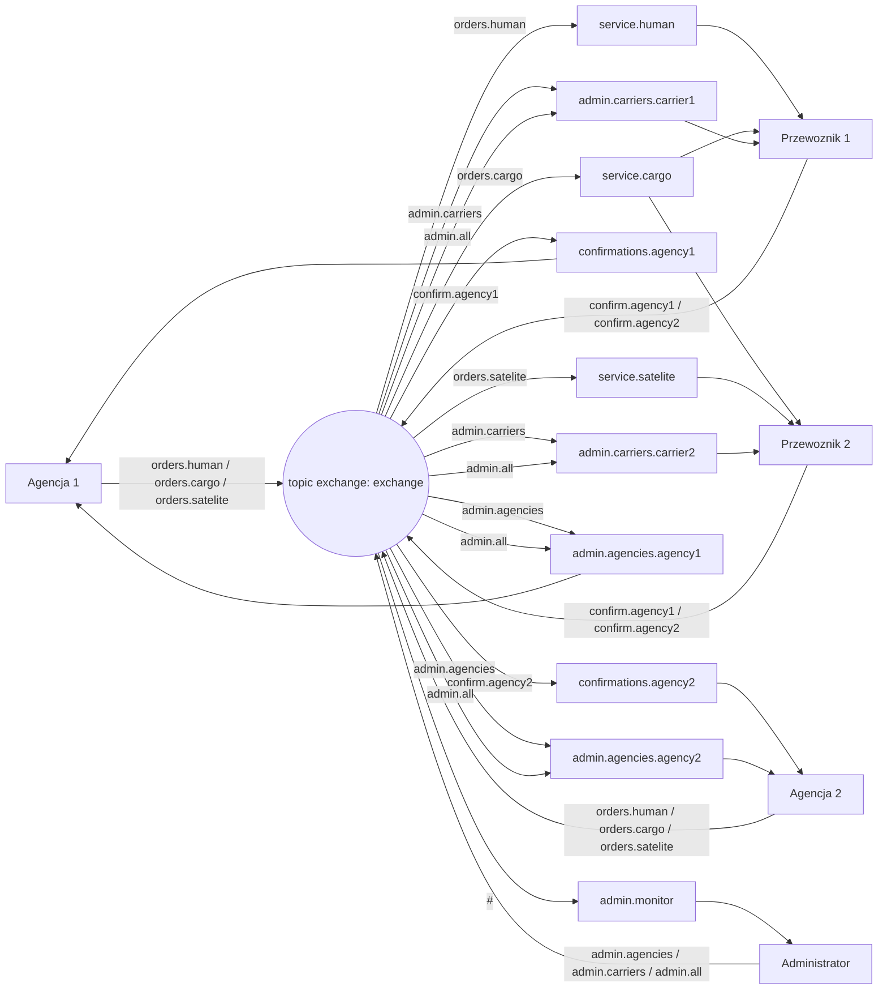

# Schemat działania systemu RabbitMQ

## Uzytkownicy (procesy)

- Agencja 1, Agencja 2
- Przewoznik 1 (human + cargo), Przewoznik 2 (cargo + satelite)
- Administrator

## Exchange

- `exchange` (typ: `topic`)

## Kolejki i klucze wiazania (binding keys)

| Kolejka | Binding key |
|---|---|
| `service.human` | `orders.human` |
| `service.cargo` | `orders.cargo` |
| `service.satelite` | `orders.satelite` |
| `confirmations.<agency>` | `confirm.<agency>` |
| `admin.agencies.<agency>` | `admin.agencies`, `admin.all` |
| `admin.carriers.<carrier>` | `admin.carriers`, `admin.all` |
| `admin.monitor` | `#` |

