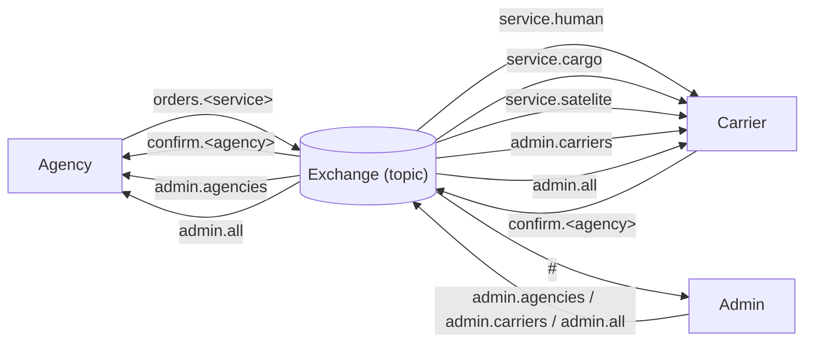

```mermaid
flowchart LR
    A[Agency] -- orders.&lt;service&gt; --> X[("Exchange (topic)")]
    X -- service.human --> C[Carrier]
    X -- service.cargo --> C
    X -- service.satelite --> C

    C -- confirm.&lt;agency&gt; --> X
    X -- confirm.&lt;agency&gt; --> A

    AD[Admin] -- admin.agencies / admin.carriers / admin.all --> X
    X -- admin.agencies --> A
    X -- admin.carriers --> C
    X -- admin.all --> A
    X -- admin.all --> C

    X -- "#" --> AD
```
