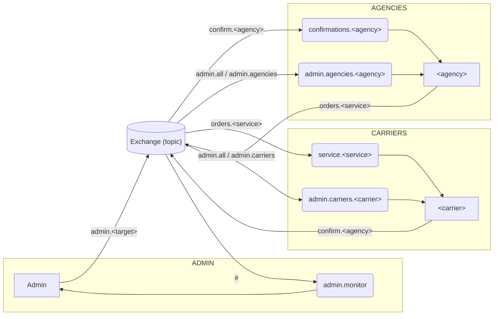

```mermaid
flowchart LR
    subgraph ADMIN
        direction LR
        AD[Admin]
        QAD(admin.monitor)
    end

    subgraph AGENCIES
        direction RL
        A[&lt;agency&gt;]
        QA(confirmations.&lt;agency&gt;)
        QAAD(admin.agencies.&lt;agency&gt;)
    end

    subgraph CARRIERS
        direction LR
        C[&lt;carrier&gt;]
        QS(service.&lt;service&gt;)
        QC(admin.carriers.&lt;carrier&gt;)
    end

    AD -- admin.&lt;target&gt; --> X[("Exchange (topic)")]
    X -- "#" --> QAD --> AD

    A -- orders.&lt;service&gt; --> X
    X -- confirm.&lt;agency&gt; --> QA --> A
    X -- admin.all / admin.agencies --> QAAD --> A

    C -- confirm.&lt;agency&gt; --> X
    X -- orders.&lt;service&gt; --> QS --> C
    X -- admin.all / admin.carriers --> QC --> C
```
